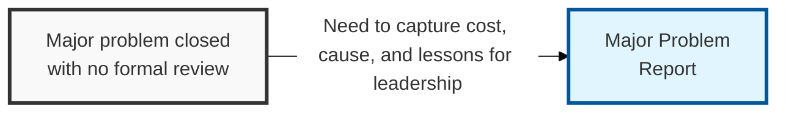
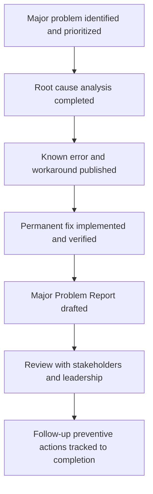

## I. Overview

**Definition**: A Major Problem Report is the formal, executive-facing review produced after a high-impact or high-recurrence problem has been resolved (or requires escalated attention).

**Features**:  
( **Ownership** ) Owned by the problem manager, typically with sign-off from service owners and, for security-rooted problems, the CISO.  
( **Root-Cause Focus** ) Explains why the fault existed in the first place, where an incident report explains only how service was restored.  
( **Cost Accounting** ) Captures what the problem cost across every recurrence, not just the final incident.  
( **Structural Change** ) Documents what structural changes prevent the problem happening again, turning a technical fix into an organizational lesson.

## II. Structure & Process

| Field | Description |
|---|---|
| Report ID | Unique identifier linking the report to the source Problem Record. |
| Executive Summary | Plain-language description of the problem, impact, and outcome. |
| Root Cause Analysis | Detailed technical findings, including analysis method used. |
| Business/Security Impact | Cumulative cost across recurrences: downtime, data exposure, revenue. |
| Timeline | Key dates from first occurrence through permanent resolution. |
| Resolution Summary | Permanent fix delivered and how it was validated. |
| Lessons Learned | Process, tooling, or design gaps identified during review. |
| Follow-Up Actions | Preventive actions with owners and target dates. |

Drafting begins once the permanent fix is verified, and the report is finalized after stakeholder review confirms the root cause, impact figures, and follow-up actions are accurate and assigned.

## III. Trends & Future Direction

| Practice | Status | Direction |
|---|---|---|
| Siloed post-incident write-ups | Legacy pattern | Being displaced by structured, circulated reports |
| Cost accounted only for the triggering incident | Common shortfall | Shifting toward cumulative cost across every recurrence |
| Follow-up actions as open-ended commitments | Still common | Moving toward change-management-tracked owners and dates |

The direction major problem reporting is heading is away from a document that gets filed and forgotten, toward one that actively feeds architecture review elsewhere in the organization — the report's real value isn't the write-up of what happened, it's whether a team running a similar stack two departments over ever sees it. Treat circulating lessons learned beyond the immediate team as the differentiator between a report that satisfies a governance checkbox and one that actually prevents the next occurrence somewhere else.

Related: [Problem Record Template](../problem-record-template/), [Known Error (KE) Record Template](../known-error-record-template/), [Major Incident Report Template](/docs/incident-management/major-incident-report-template/).
