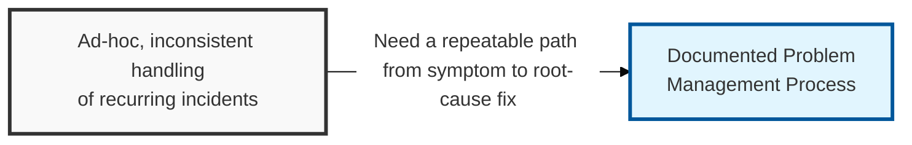
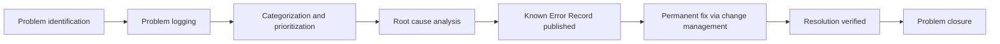

## I. Overview

**Definition**: The Problem Management Process defines how an organization moves from a pattern of incidents to a diagnosed root cause to a permanent fix, in a repeatable, auditable way.

**Features**:  
( **Ownership** ) Owned by the problem manager as a process document.  
( **Reference Use** ) Referenced by service desk, incident response, and engineering teams whenever incidents recur or a single incident warrants investigation.  
( **ITIL Distinction** ) Enforces the ITIL split between incident management, optimized for speed of restoration, and problem management, optimized for permanence of resolution.  
( **Trade-off** ) Deliberately trades immediate closure for durable prevention of the root cause.

## II. Structure & Process

| Field | Description |
|---|---|
| Process Stage | Named phase, e.g. identification, logging, categorization, diagnosis. |
| Entry Criteria | Condition that triggers the stage, such as recurrence threshold. |
| Key Activities | Actions performed by the problem manager or investigation team. |
| Roles Involved | Service desk, problem manager, technical SMEs, security team. |
| Exit Criteria | Deliverable required to advance, e.g. confirmed root cause. |
| Supporting Records | Problem Record, Known Error Record, or Major Problem Report produced. |

Problems are identified either proactively, through trend analysis of incident data, or reactively, from a single major incident; both paths converge on the same logging, diagnosis, and closure stages so every problem is tracked with equal rigor regardless of origin.

## III. Best Practices & Comparison

| Document | Primary Purpose | Trigger | Owner |
|---|---|---|---|
| Problem Management Process | Define the repeatable workflow from symptom to root-cause fix | Ongoing process governance | Problem manager |
| Problem Record Template | Instance record of one problem moving through the process | Recurring or significant incident pattern | Problem manager |
| Known Error (KE) Record Template | Interim workaround produced mid-process | Root cause confirmed, fix pending | Problem manager |

- Run proactive trend analysis on closed incidents regularly, not only after a major incident forces reactive review.
- Set explicit exit criteria per stage so problems cannot silently stall between diagnosis and fix.
- Feed a security incident's confirmed root cause into this process as a formal problem, rather than closing it purely within incident response.
- Prioritize problems by cumulative business impact across recurrences, not by the severity of any single incident.
- Review the process itself periodically against actual cycle times to catch bottlenecks between diagnosis and permanent fix.

Related: [Problem Record Template](../problem-record-template/), [Known Error (KE) Record Template](../known-error-record-template/), [Major Problem Report Template](../major-problem-report-template/).
