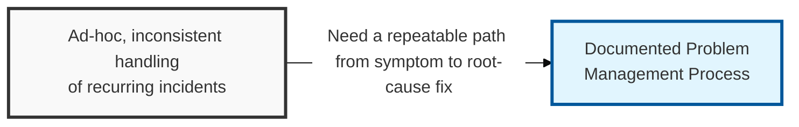
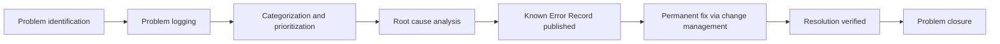

## I. Overview

**Definition**: The Problem Management Process defines how an organization moves from a pattern of incidents to a diagnosed root cause to a permanent fix, in a repeatable, auditable way.

**Features**:  
( **Ownership** ) Owned by the problem manager as a process document.  
( **Reference Use** ) Referenced by service desk, incident response, and engineering teams whenever incidents recur or a single incident warrants investigation.  
( **ITIL Distinction** ) Enforces the ITIL split between incident management, optimized for speed of restoration, and problem management, optimized for permanence of resolution.  
( **Trade-off** ) Deliberately trades immediate closure for durable prevention of the root cause.

## II. Structure & Process

| Field | Description |
|---|---|
| Process Stage | Named phase, e.g. identification, logging, categorization, diagnosis. |
| Entry Criteria | Condition that triggers the stage, such as recurrence threshold. |
| Key Activities | Actions performed by the problem manager or investigation team. |
| Roles Involved | Service desk, problem manager, technical SMEs, security team. |
| Exit Criteria | Deliverable required to advance, e.g. confirmed root cause. |
| Supporting Records | Problem Record, Known Error Record, or Major Problem Report produced. |

Problems are identified either proactively, through trend analysis of incident data, or reactively, from a single major incident; both paths converge on the same logging, diagnosis, and closure stages so every problem is tracked with equal rigor regardless of origin.

## III. Expected Benefits & Implications

A formal problem management process is often the easiest line item to cut, because in a quiet quarter it looks like documentation layered on top of incident response that already restored everything. The payoff is uneven by design — most incidents never touch this process, but the recurring ones that do would otherwise consume the same on-call hours over and over with nothing to show for it.

| Benefit | Where It Shows Up |
|---|---|
| Falling repeat-incident rate | Incident trend reports, month over month |
| Faster diagnosis on recurrence | Known Error Records reused instead of re-investigated |
| Defensible root-cause evidence | Security and audit reviews of recurring exposure |
| Bounded investigation backlog | Explicit exit criteria per stage, not open-ended tickets |

Measure the process by the trend in repeat-incident rate, not by problem-record volume — a team can log plenty of problem records and still leave the same root causes unfixed. The more durable implication is organizational: feeding a security incident's confirmed root cause into this process, rather than closing it purely within incident response, is what turns a one-off patch into a documented, auditable decision that survives staff turnover.

Related: [Problem Record Template](../problem-record-template/), [Known Error (KE) Record Template](../known-error-record-template/), [Major Problem Report Template](../major-problem-report-template/).
