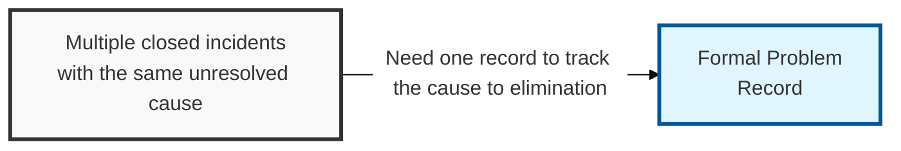
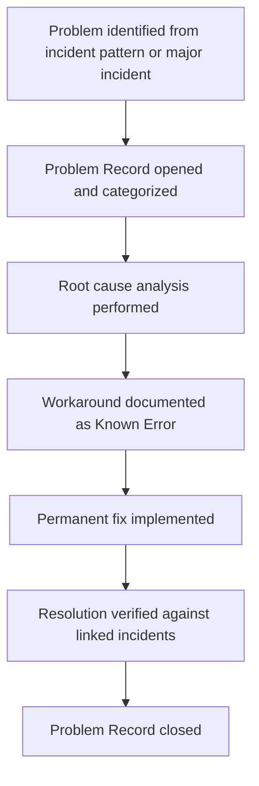

## I. Overview

**Definition**: A Problem Record is the individual working document that tracks one problem's investigation, from initial suspicion of a common root cause through diagnosis, workaround, and permanent resolution.

**Features**:  
( **Ownership** ) Opened and maintained by the problem manager, with technical input from the engineering or security teams best placed to diagnose the fault.  
( **Lifecycle** ) Stays open until the underlying cause is eliminated, unlike an incident ticket that closes once service is restored.  
( **Single Source** ) Gives the organization a single place to track that longer-running investigation effort.  
( **Investigation Trail** ) Records the path from initial suspicion of a common root cause through diagnosis, workaround, and permanent resolution.

## II. Structure & Process

| Field | Description |
|---|---|
| Problem ID | Unique identifier for the record. |
| Description | Symptom pattern and scope of the suspected common cause. |
| Priority | Impact and urgency ranking used to sequence investigation. |
| Root Cause | Diagnosed cause once root-cause analysis is complete. |
| Workaround | Interim mitigation, if any, pending permanent fix. |
| Known Error Status | Whether the problem has been published as a known error. |
| Linked Incidents | Incident records that triggered or are associated with this problem. |
| Resolution/Closure Details | Permanent fix applied and verification evidence. |

The record stays open through diagnosis and remediation, referencing every linked incident as evidence of ongoing impact, and closes only when the permanent fix is verified to prevent recurrence.

## III. Best Practices & Comparison

| Document | Primary Purpose | Trigger | Owner |
|---|---|---|---|
| Problem Record Template | Track one problem's investigation from open to closed | Recurring or significant incident pattern | Problem manager |
| Known Error (KE) Record Template | Publish the interim workaround for a diagnosed root cause | Root cause confirmed, fix pending | Problem manager |
| Major Incident Report Template | Document how a single major incident was detected and restored | Major incident declared | Incident commander |

- Open a problem record as soon as a pattern of recurring incidents is detected, rather than waiting for a major incident.
- Link every related incident to the problem record so its cumulative impact is visible when prioritizing fixes.
- Keep root cause and workaround fields updated in real time so the known error record can be published without delay.
- Do not close the record until the permanent fix is verified against a recurrence, not merely deployed.
- Distinguish problem closure from incident closure explicitly: an incident can close while its root-cause problem remains open.

Related: [Known Error (KE) Record Template](../known-error-record-template/), [Problem Management Process](../problem-management-process/), [Major Problem Report Template](../major-problem-report-template/).
