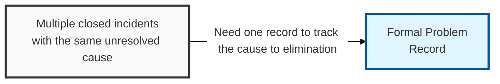
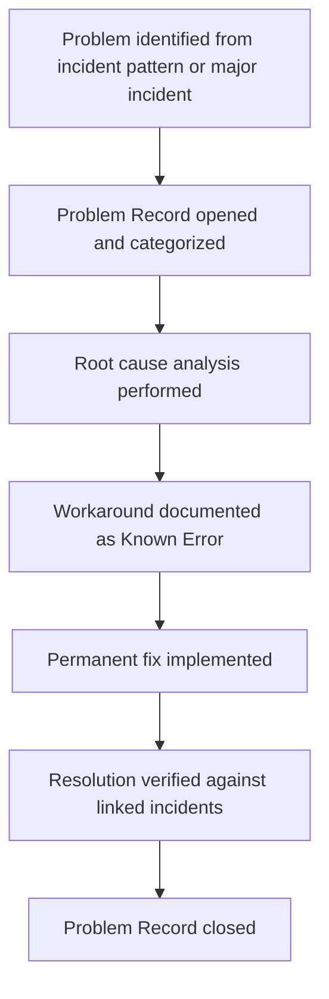

## I. Overview

**Definition**: A Problem Record is the individual working document that tracks one problem's investigation, from initial suspicion of a common root cause through diagnosis, workaround, and permanent resolution.

**Features**:  
( **Ownership** ) Opened and maintained by the problem manager, with technical input from the engineering or security teams best placed to diagnose the fault.  
( **Lifecycle** ) Stays open until the underlying cause is eliminated, unlike an incident ticket that closes once service is restored.  
( **Single Source** ) Gives the organization a single place to track that longer-running investigation effort.  
( **Investigation Trail** ) Records the path from initial suspicion of a common root cause through diagnosis, workaround, and permanent resolution.

## II. Structure & Process

| Field | Description |
|---|---|
| Problem ID | Unique identifier for the record. |
| Description | Symptom pattern and scope of the suspected common cause. |
| Priority | Impact and urgency ranking used to sequence investigation. |
| Root Cause | Diagnosed cause once root-cause analysis is complete. |
| Workaround | Interim mitigation, if any, pending permanent fix. |
| Known Error Status | Whether the problem has been published as a known error. |
| Linked Incidents | Incident records that triggered or are associated with this problem. |
| Resolution/Closure Details | Permanent fix applied and verification evidence. |

The record stays open through diagnosis and remediation, referencing every linked incident as evidence of ongoing impact, and closes only when the permanent fix is verified to prevent recurrence.

## III. Comparison & Application

| Document | Primary Purpose | Trigger | Owner |
|---|---|---|---|
| Problem Record | Track investigation of a suspected root cause from open to closed | Recurring or significant incident pattern | Problem manager |
| Known Error (KE) Record | Publish the interim workaround once root cause is confirmed | Root cause confirmed, fix pending | Problem manager |
| Major Problem Report | Formal post-resolution review for leadership | High-impact problem, after permanent fix verified | Problem manager / service owner |

The distinction that matters day to day is between the Problem Record and the Known Error Record it spawns midway through: the Problem Record is the open investigation, and the Known Error Record is what gets published once that investigation confirms a root cause but before a permanent fix exists. Treat the record's Known Error Status field as the trigger — the moment root cause is confirmed, publish the Known Error immediately rather than waiting for the Problem Record itself to close, since the service desk needs the workaround long before the permanent fix ships.

Related: [Known Error (KE) Record Template](../known-error-record-template/), [Problem Management Process](../problem-management-process/), [Major Problem Report Template](../major-problem-report-template/).
