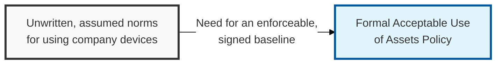
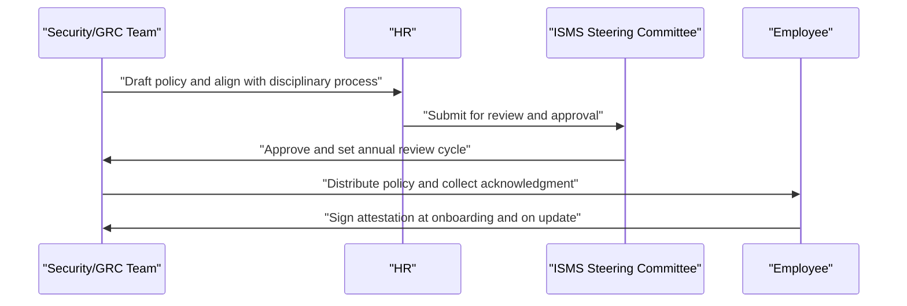

## I. Overview

**Definition**: An Acceptable Use of Assets Policy (AUP) is the document that sets the rules for how employees, contractors, and third parties may use company-owned IT assets — laptops, mobile devices, email accounts, cloud storage, and network access.

**Features**:  
( **Ownership** ) Maintained by the CISO or IT security team and enforced jointly with HR, since violations can trigger disciplinary action.  
( **Audit Basis** ) Gives the organization a documented basis for monitoring, restricting, and disciplining misuse.  
( **Legal Standing** ) Holds up in an audit, a legal dispute, or a termination-for-cause case where informal expectations would not.  
( **Scope** ) Covers company-owned devices, accounts, cloud storage, and network access across employees and third parties.

## II. Structure & Process

| Field | Description |
|---|---|
| Scope of Assets | Devices, accounts, and services covered — laptops, mobile devices, email, cloud storage, network access. |
| Permitted Use | Business use and reasonable incidental personal use, clearly bounded. |
| Prohibited Activities | Unauthorized software installation, unlicensed media, illegal content, harassment, personal commercial activity. |
| Monitoring & Privacy Notice | Statement that company assets and traffic may be logged, inspected, or monitored. |
| BYOD Provisions | Rules for personally owned devices accessing corporate data, if permitted. |
| Consequences of Violation | Disciplinary escalation path, up to termination and legal referral. |
| Acknowledgment Requirement | Signature or digital attestation required at onboarding and on policy update. |
| Exception Process | How a business unit requests a deviation, and who approves it. |

The AUP is drafted by security with HR input, approved by the ISMS steering committee, and reissued for signature whenever materially revised — typically on an annual cycle or after a significant incident prompts a scope change.

## III. Best Practices & Comparison

| Document | Primary Purpose | Review Cadence | Owner |
|---|---|---|---|
| Acceptable Use of Assets Policy | Define permitted/prohibited use of company IT assets | Annual | CISO / GRC team |
| Password Policy | Set authentication strength requirements | Annual | CISO / GRC team |
| Information Classification Policy | Define sensitivity tiers for handling data | Annual or on data inventory change | Data owners, security team |

- Require signed acknowledgment at onboarding and after every material revision, not just once at hire.
- State the monitoring and privacy notice explicitly to avoid disputes over expectation of privacy.
- Keep prohibited-activity language specific enough to be enforceable, not just aspirational.
- Align disciplinary consequences with HR's existing progressive-discipline framework.
- Review annually and after any incident that exposes a gap in current asset-use rules.

Related: [Password Policy](../password-policy/), [Information Classification Policy](../information-classification-policy/).
