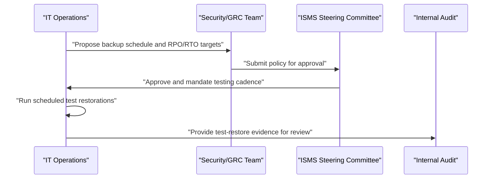

## I. Overview

**Definition**: A Backup and Recovery Policy is the document that defines what data must be backed up, how often, where copies are stored, and how restoration is tested and executed.

**Features**:  
( **Ownership** ) Jointly owned by IT operations, who run the backups, and the CISO or GRC team, who set the risk-driven requirements.  
( **Coverage Assurance** ) Prevents backup coverage from drifting, where some systems end up backed up inconsistently or not at all.  
( **Early Discovery** ) Surfaces gaps before an actual incident, rather than after it is too late to correct.  
( **Restoration Testing** ) Requires that restoration procedures are tested and executed, not just that backups are taken.

## II. Structure & Process

| Field | Description |
|---|---|
| Scope of Systems | Which systems and data stores are covered, prioritized by business criticality. |
| Backup Frequency | How often backups run — continuous, daily, weekly — per system tier. |
| Recovery Point Objective (RPO) | Maximum acceptable data loss, measured in time, per system. |
| Recovery Time Objective (RTO) | Maximum acceptable downtime before restoration, per system. |
| Retention Period | How long backup copies are kept before rotation or deletion. |
| Storage & Offsite Requirements | Onsite vs. offsite/cloud copies, encryption at rest, and geographic separation. |
| Restoration Testing | Frequency and method of test restores to validate backup integrity. |
| Incident Escalation | Who authorizes and executes a restoration during an active incident. |

IT operations proposes technical parameters, security/GRC validates them against business impact analysis, and the ISMS steering committee approves the policy. Test restorations are logged as evidence and reviewed by internal audit; the policy itself is reviewed annually or after any recovery failure.

## III. Adoption Considerations & Security Measures

| Risk | Primary Control |
|---|---|
| Ransomware encrypting backups alongside production | Offline or air-gapped copy, immutable storage |
| Untested restore procedures failing under pressure | Scheduled test restorations with logged evidence |
| Uniform RPO/RTO ignoring system criticality | Tiered targets set from business impact analysis |
| Backup data exposed in transit or at rest | Mandatory encryption on offsite and cloud copies |

An untested backup is a hypothesis, not a control — the only way to know a restore will actually work during a real incident is to have already done it under a fire drill. Ransomware operators now actively hunt for connected backup targets before triggering encryption, so at least one copy needs to be genuinely unreachable from the production network, not just "logically separate."

Related: [ISMS Policy](../isms-policy/), [Disposal and Destruction Policy](../disposal-and-destruction-policy/).
