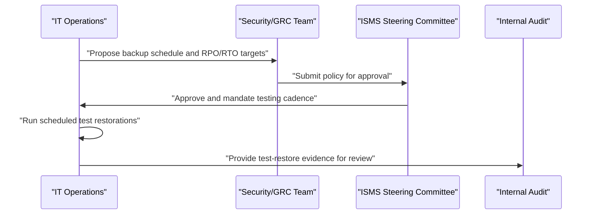

## I. Overview

**Definition**: A Backup and Recovery Policy is the document that defines what data must be backed up, how often, where copies are stored, and how restoration is tested and executed.

**Features**:  
( **Ownership** ) Jointly owned by IT operations, who run the backups, and the CISO or GRC team, who set the risk-driven requirements.  
( **Coverage Assurance** ) Prevents backup coverage from drifting, where some systems end up backed up inconsistently or not at all.  
( **Early Discovery** ) Surfaces gaps before an actual incident, rather than after it is too late to correct.  
( **Restoration Testing** ) Requires that restoration procedures are tested and executed, not just that backups are taken.

## II. Structure & Process

| Field | Description |
|---|---|
| Scope of Systems | Which systems and data stores are covered, prioritized by business criticality. |
| Backup Frequency | How often backups run — continuous, daily, weekly — per system tier. |
| Recovery Point Objective (RPO) | Maximum acceptable data loss, measured in time, per system. |
| Recovery Time Objective (RTO) | Maximum acceptable downtime before restoration, per system. |
| Retention Period | How long backup copies are kept before rotation or deletion. |
| Storage & Offsite Requirements | Onsite vs. offsite/cloud copies, encryption at rest, and geographic separation. |
| Restoration Testing | Frequency and method of test restores to validate backup integrity. |
| Incident Escalation | Who authorizes and executes a restoration during an active incident. |

IT operations proposes technical parameters, security/GRC validates them against business impact analysis, and the ISMS steering committee approves the policy. Test restorations are logged as evidence and reviewed by internal audit; the policy itself is reviewed annually or after any recovery failure.

## III. Best Practices & Comparison

| Document | Primary Purpose | Review Cadence | Owner |
|---|---|---|---|
| Backup and Recovery Policy | Guarantee recoverability of data and systems | Annual | IT operations, CISO / GRC team |
| Information Classification Policy | Define sensitivity tiers that drive backup encryption needs | Annual or on data inventory change | Data owners, security team |
| ISMS Policy | Set the overarching management-system framework | Annual | CISO |

- Set RPO/RTO per system tier based on business impact, not a single blanket target for everything.
- Test restorations on a fixed schedule; an untested backup is an unverified assumption.
- Keep at least one backup copy offsite or air-gapped to survive ransomware that targets connected backups.
- Encrypt backup data at rest and in transit, especially for offsite and cloud copies.
- Document and rehearse the restoration escalation path so recovery isn't improvised during an incident.

Related: [ISMS Policy](../isms-policy/), [Disposal and Destruction Policy](../disposal-and-destruction-policy/).
