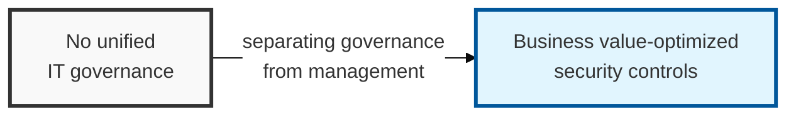

## I. Overview

**Definition**: COBIT-based security management is a control framework that clearly separates security activities into governance and management, so that security risk is evaluated from a business perspective and security investment is aligned with enterprise objectives.

**Features**:  
( **Structured Governance** ) Security activities are clearly divided into Governance and Management and controlled separately.  
( **Business Alignment** ) Security risk is evaluated from a business standpoint so that security investment is aligned with the achievement of enterprise goals.  
( **Optimized Risk Management** ) Precise, framework-based diagnostics keep security risk managed at an acceptable level.

## II. Mechanism & Components

### Layered Structure of Security Governance and Management

- **Governance (EDM)**: Led by the board of directors, which Evaluates security strategy, gives Direction, and Monitors performance.
- **Management (PBRM)**: Led by executive management, which carries out the Plan, Build, Run, and Monitor stages of security execution.

### Core Security-Related Domains and Activities

| Domain | Key Security Management Activity | Core Keyword |
|:---:|------------------|-----------------|
| **EDM03** | Ensuring and optimizing security risk | Risk Appetite |
| **APO12** | Establishing the security risk management process | IT risk profiling |
| **APO13** | Operating the Information Security Management System (ISMS) | Security policies and guidelines |
| **BAI06** | Managing secure change and configuration | Secure Release |
| **DSS05** | Operating security services and incident response | Vulnerability management, account and access control |
| **MEA02** | Systematically monitoring the security control system | Internal control and regulatory compliance |

## III. Advanced Topics & Comparison

### Considerations for Adoption (Tailoring)

- **Design Factors**: Control items must be tailored to the organization's size, threat level, and compliance requirements.
- **Focus Areas**: Security design needs to concentrate on specific areas such as cybersecurity and cloud computing.

### Expected Benefits

- **Business Alignment**: Demonstrates that security investment contributes to business value creation (Strategic Alignment).
- **Clear Accountability**: A **RACI** chart (Responsible / Accountable / Consulted / Informed) clearly defines security roles and responsibilities.
- **Risk Visibility**: An enterprise-wide risk dashboard enables real-time visibility into security status and faster decision-making.
