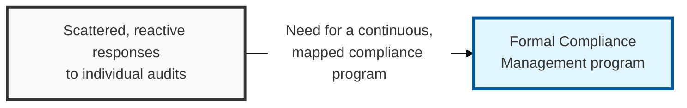
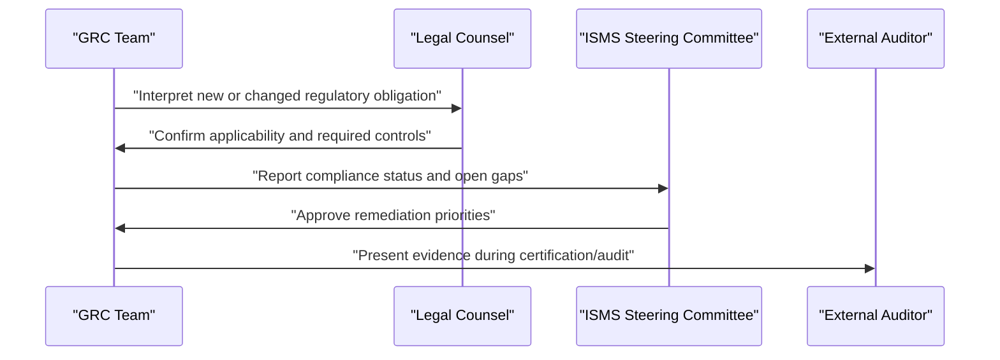

## I. Overview

**Definition**: Compliance Management is the ongoing program that maps applicable laws, regulations, industry standards, and contractual obligations to internal controls, and tracks whether those controls are actually operating.

**Features**:  
( **Ownership** ) Owned by the CISO or a dedicated GRC function, with input from legal counsel on regulatory interpretation.  
( **Regulatory Scope** ) Spans obligations such as ISO/IEC 27001, ISMS-P, GDPR, and sector-specific rules across jurisdictions and customer contracts.  
( **Central Tracking** ) Replaces scattered awareness with a central mechanism that tracks whether controls are actually operating.  
( **Early Detection** ) Surfaces gaps before an audit finding or regulatory inquiry exposes them.

## II. Structure & Process

| Field | Description |
|---|---|
| Obligation Inventory | Register of applicable laws, standards, and contractual security clauses. |
| Control Mapping | Which internal control satisfies which obligation, avoiding duplicated effort. |
| Evidence Collection | How proof of control operation is gathered and stored for audit. |
| Gap Tracking | Register of identified deficiencies, owners, and remediation deadlines. |
| Audit Calendar | Schedule of internal reviews, external assessments, and certification cycles. |
| Regulatory Change Monitoring | Process for detecting new or amended obligations. |
| Reporting Cadence | How compliance status is reported to leadership and the board. |
| Non-Compliance Escalation | Path for escalating unresolved gaps that carry legal or contractual risk. |

The GRC team maintains the obligation inventory and control mapping continuously, with legal input on interpretation. Status is reported to the ISMS steering committee on a fixed cadence, and external audits or certification assessments validate the program on their own cycle, typically annually.

## III. Best Practices & Comparison

| Document | Primary Purpose | Review Cadence | Owner |
|---|---|---|---|
| Compliance Management | Track and evidence adherence to laws, standards, contracts | Continuous, with periodic formal reporting | CISO / GRC team |
| ISMS Policy | Set the management-system framework compliance operates within | Annual | CISO |
| Information Classification Policy | Define data sensitivity tiers referenced by many compliance obligations | Annual or on data inventory change | Data owners, security team |

- Maintain a single control-mapping matrix rather than tracking each regulation or standard in isolation.
- Collect evidence continuously, not just in the weeks before an audit.
- Assign a named owner and deadline to every open compliance gap.
- Monitor regulatory change sources actively rather than waiting for a customer or auditor to flag a new obligation.
- Report compliance posture to leadership on a fixed, predictable cadence to keep it a standing agenda item.

Related: [ISMS Policy](../isms-policy/), [Information Classification Policy](../information-classification-policy/).
