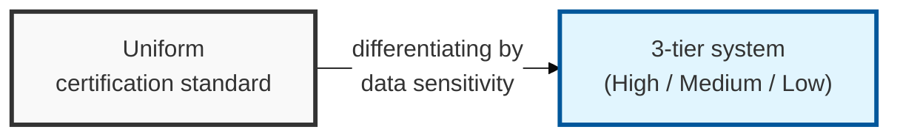
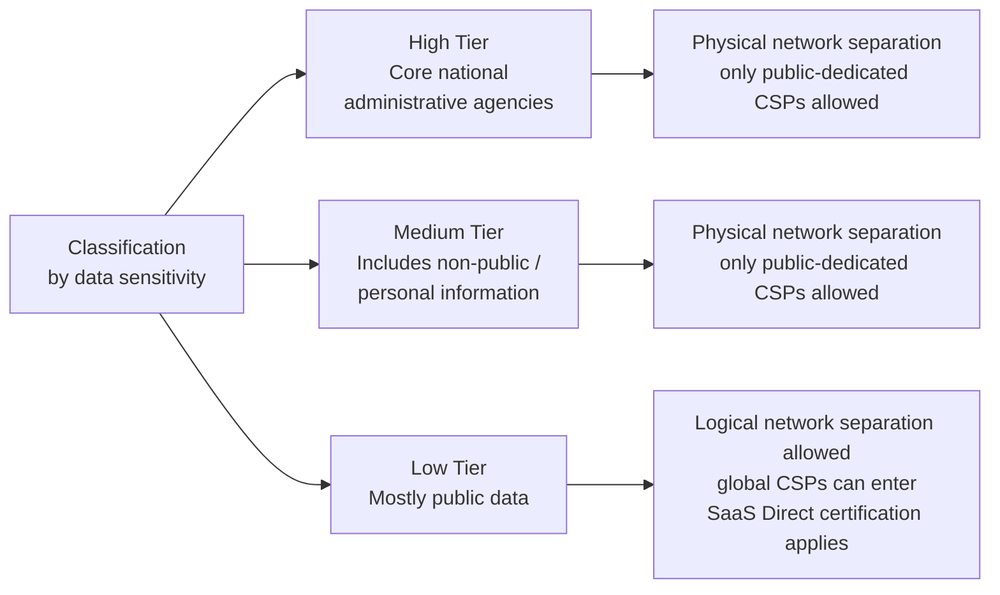

## I. Overview

**Definition**: The Cloud Security Assurance Program ( **CSAP** ) is a certification scheme that applies differentiated security criteria in 3 tiers, "High, Medium, and Low," according to the sensitivity of the data handled by the cloud service a public agency intends to adopt.

**Background of the restructuring**:  
( **Market opening** ) Permitting logical network separation for the "Low" tier lowers the barrier for global **CSPs** and innovative **SaaS** providers to enter the public sector market.  
( **Accelerating transition** ) Expands the scope for using private cloud to accelerate the public sector's cloud-native transition.  
( **Greater flexibility** ) Moves away from a one-size-fits-all security standard and applies the security controls best suited to the nature of the data, improving management efficiency.

## II. Mechanism & Components

### The 3-Tier System by Data Sensitivity

> **Key point**: Tiers range from core national networks (High), through those including sensitive information (Medium), to mostly public data (Low).

### Detailed Certification Requirements by Tier

| Tier | Applicable Scope (Data Sensitivity) | Key Security Requirements | Physical Separation Requirement |
|:----:|------------------------|--------------|:-------------:|
| High | Core national administrative agencies handling diplomacy/security, investigation/trial, etc. | Highest security level, for services requiring high performance such as AI/big data | Physical network separation maintained (public-dedicated only) |
| Medium | Non-public consultation data, services including personal information (equivalent to the existing CSAP level) | Protection of sensitive information, vulnerability inspection, incident response system | Physical network separation maintained (public-dedicated only) |
| Low | Public services handling data without personal information, mainly public data | Commercial general-purpose services (SaaS/IaaS) allowed, demonstration-focused security | Logical network separation allowed (global CSPs can enter) |

## III. Comparison & Application

| Tier | Best Fit | Trade-off |
|---|---|---|
| High | Diplomacy, security, investigation/trial systems | Highest assurance, physical separation only, slowest CSP onboarding |
| Medium | Systems handling personal or non-public consultation data | Equivalent to legacy CSAP; still public-dedicated CSPs only |
| Low | Public-facing services with no personal information | Fastest path to market via SaaS Direct, weakest assurance floor |

Don't default to the tier a service "feels" like it needs — map it against the data it actually touches, since over-tiering just slows procurement without adding real protection, and under-tiering is the finding an auditor catches first. The Low tier's SaaS Direct path is the one worth watching: it's the fastest on-ramp for global CSPs into Korea's public sector, but it also means post-certification monitoring, not the initial audit, is now doing most of the security work.
