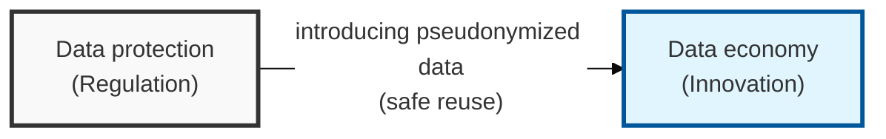
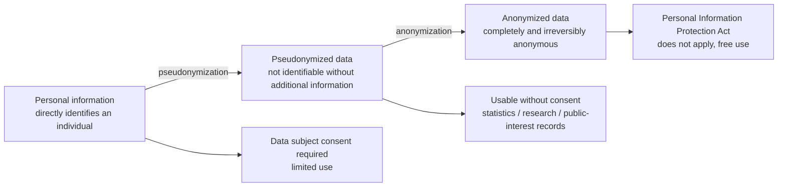
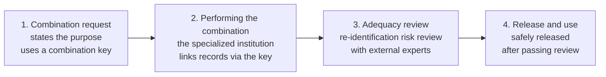

## I. Overview

**Definition**: The Data 3 Acts are a body of law, created by amending the Personal Information Protection Act, the Act on Promotion of Information and Communications Network Utilization, and the Credit Information Use and Protection Act, that clearly defines the scope of pseudonymizing and using personal information and unifies the surrounding legal framework.

**Background and key value**:  
( **Unifying regulation** ) Consolidates personal-information-related laws that had been scattered across different ministries, preventing confusion in enforcement and improving efficiency.  
( **Enabling data use** ) Establishes a legal basis for using pseudonymized data without the data subject's consent for public-interest purposes such as statistics compilation and scientific research.  
( **Building trust** ) Mandates technical and administrative safeguards, including a ban on re-identification, to balance protecting data subjects' rights with driving industry innovation.

## II. Mechanism & Components

### Data Classification by Identifiability

| Category | Definition | Scope of Use |
|------|------|--------------|
| Personal information | Information that can directly identify a specific individual | Limited use with the data subject's consent |
| Pseudonymized data | Information processed so that a specific individual cannot be identified without additional information | Statistics compilation, scientific research, public-interest record preservation (usable without consent) |
| Anonymized data | Information from which an individual can no longer be identified, considering time, cost, and technology | Free, unrestricted use (the Personal Information Protection Act does not apply) |

### Technical Protection Measures for Processing Pseudonymized Data

- **Preventing re-identification**: Mandates separate storage of the additional information, access control, and physical/technical safeguards.
- **Prohibited acts**: Re-identifying a specific individual is prohibited (violations carry administrative fines and criminal penalties).

## III. Advanced Topics & Comparison

### Combination Procedure for Pseudonymized Data (Between Different Data Controllers)

Combining pseudonymized data is, for security reasons, only permitted through a "specialized data combination institution," and follows a 4-step procedure.

### Detailed Comparison of Pseudonymized and Anonymized Data

| Comparison Item | Pseudonymous Data | Anonymous Data |
|----------|------------------------|---------------------|
| Identifiability | Relative anonymity (identifiable if combined with additional information) | Absolute anonymity (irrecoverable) |
| Data Utility | High (individual-level analysis possible) | Low (only statistical properties remain) |
| Applicability of the Personal Information Protection Act | Applies (safeguard obligations apply) | Does not apply (free circulation) |
| Liability on Incident | Legal penalties if re-identified | Not applicable |
