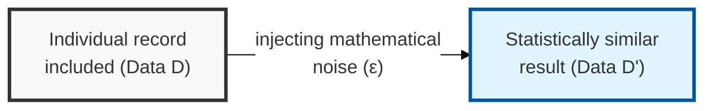
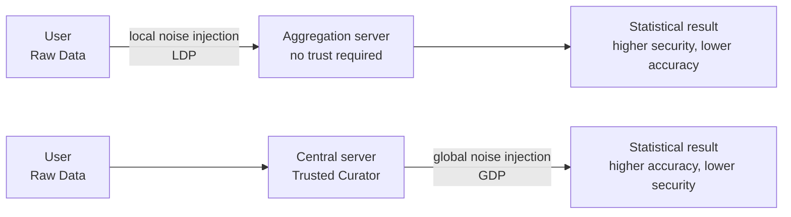

## I. Overview

**Definition**: Differential privacy is a privacy-protection mechanism that injects mathematical noise into a probability distribution so that a statistical analysis result is nearly identical regardless of whether any one individual's data is included in the dataset.

**Core principle and features**:  
( **Defense against background-knowledge attacks** ) Mathematically proves that a specific individual cannot be identified even if an attacker holds external (background) information.  
( **Privacy budget** ) The smaller the value of `ε` ( **Privacy Budget** ), the stronger the privacy protection — but the lower the utility of the data, creating a trade-off.  
( **Mathematical rigor** ) The degree of privacy exposure is quantitatively controlled through a formula such as `Pr[M(D) ∈ S] ≤ e^ε × Pr[M(D') ∈ S]`.

## II. Mechanism & Components

### Implementation Models by Noise-Injection Location

> **Key point**: Differential privacy is divided into the **local method (LDP)**, where noise is added on the user's device, and the **global method (GDP)**, where noise is added at the collecting central database.

### Key Components and Techniques

| Component | Detailed Description | Note |
|----------|---------|------|
| Privacy Budget (ε) | The tolerance range allowed for data exposure. The smaller it is, the higher the security and the lower the accuracy | Core tuning parameter |
| Laplace Mechanism | Adds Laplace-distribution-based noise to the data | Suited to numerical data |
| Sensitivity | The maximum change a single record can cause in a query result | Determines the size of the noise |
| Exponential Mechanism | Selects the optimal answer when responding with non-numerical (categorical) data | Applied to categorical data |

## III. Advanced Topics & Comparison

### Differential Privacy vs. the k-Anonymity Model

| Comparison Item | k-Anonymity Family | Differential Privacy |
|----------|--------------------------|-------------------------------------|
| Mathematical Definition | Empirical/structural de-identification (transforming values) | Based on rigorous mathematical proof (controlling the probability distribution) |
| Attack Defense | Defends against linking attacks and re-identification attacks | Robust against background-knowledge attacks |
| Data Form | Structured datasets (micro-data) | Query responses and statistics (statistical output) |
| Limitation | Re-identification risk persists, weak against high-dimensional data | Data accuracy degrades due to noise injection |
