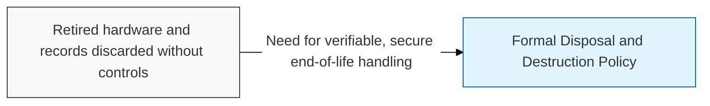
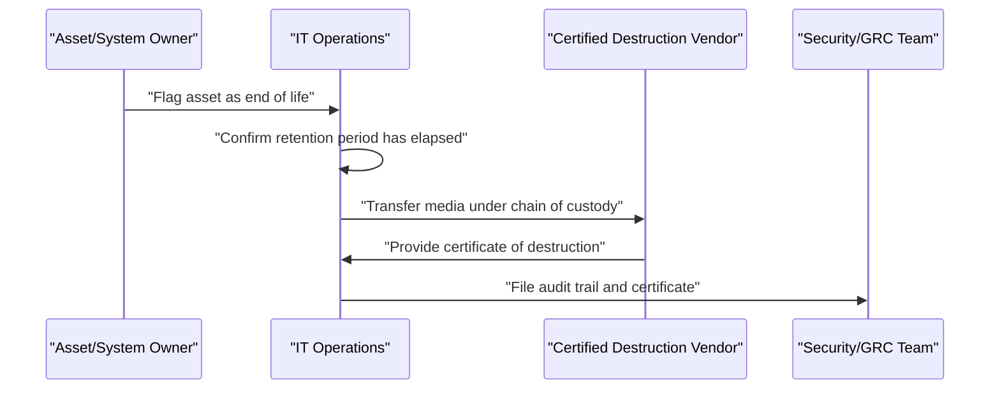

## I. Overview

A Disposal and Destruction Policy defines how data-bearing assets — hard drives, backup tapes, mobile devices, printed records — must be sanitized or physically destroyed once they are no longer needed, so that discarded equipment or paper cannot leak sensitive information. It is maintained by the CISO or GRC team and executed by IT operations and facilities, often with certified third-party destruction vendors for high-sensitivity media. A written policy is necessary because retired equipment and old paper records are a well-documented breach vector, and regulators expect proof that decommissioned assets were sanitized, not just discarded.

## II. Structure & Process

| Field | Description |
|---|---|
| Asset Scope | Media types covered — hard drives, SSDs, backup tapes, mobile devices, paper records. |
| Sanitization Method | Approved method per media type — cryptographic erasure, degaussing, physical shredding. |
| Sensitivity-Based Handling | Stricter destruction requirements tied to the data's classification level. |
| Chain of Custody | Tracking of the asset from decommission to final destruction. |
| Certificate of Destruction | Documentation required from internal teams or third-party vendors as proof. |
| Vendor Requirements | Qualification criteria for any outsourced destruction service. |
| Retention Before Disposal | Minimum holding period required by legal or regulatory obligation before destruction is permitted. |
| Audit Trail | Log of what was destroyed, when, by whom, and with what method. |

IT operations initiates disposal once an asset's retention obligation has lapsed, routes sensitive media to a certified destruction vendor, and files the resulting certificate with security/GRC as audit evidence. The policy itself is reviewed annually or when new media types are introduced.

## III. Best Practices & Comparison

| Document | Primary Purpose | Review Cadence | Owner |
|---|---|---|---|
| Disposal and Destruction Policy | Ensure secure end-of-life handling of data-bearing assets | Annual | CISO / GRC team, IT operations |
| Information Classification Policy | Define sensitivity tiers that dictate destruction method | Annual or on data inventory change | Data owners, security team |
| Backup and Recovery Policy | Govern retention of backup copies before they qualify for disposal | Annual | IT operations, CISO / GRC team |

- Match the destruction method to the data's classification tier — shredding or degaussing for the most sensitive media.
- Require a certificate of destruction for every disposal event, especially when a third-party vendor is used.
- Maintain chain of custody from decommission to destruction to close any gap where media could be diverted.
- Confirm legal and regulatory retention periods have elapsed before authorizing disposal.
- Extend the policy to paper records and printed output, not only electronic media.

Related: [Information Classification Policy](../information-classification-policy/), [Backup and Recovery Policy](../backup-and-recovery-policy/).
