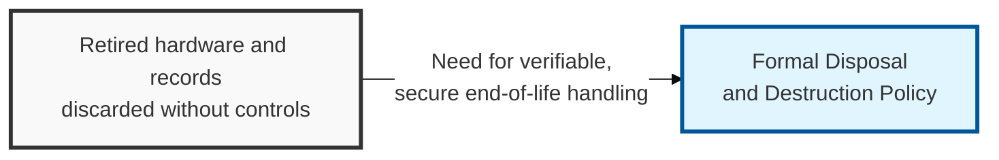
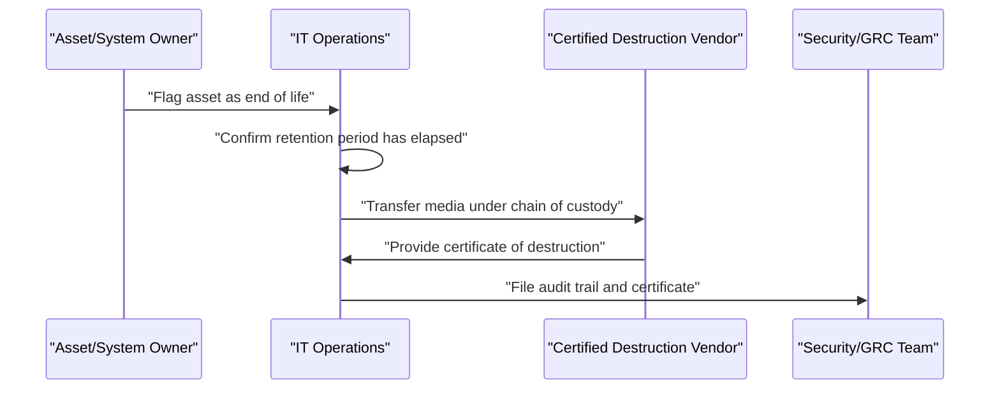

## I. Overview

**Definition**: A Disposal and Destruction Policy is the document that defines how data-bearing assets — hard drives, backup tapes, mobile devices, printed records — must be sanitized or physically destroyed once they are no longer needed.

**Features**:  
( **Ownership** ) Maintained by the CISO or GRC team and executed by IT operations and facilities.  
( **Third-Party Destruction** ) Often relies on certified third-party destruction vendors for high-sensitivity media.  
( **Breach Prevention** ) Prevents discarded equipment or paper records from leaking sensitive information, a well-documented breach vector.  
( **Regulatory Proof** ) Gives regulators proof that decommissioned assets were sanitized, not just discarded.

## II. Structure & Process

| Field | Description |
|---|---|
| Asset Scope | Media types covered — hard drives, SSDs, backup tapes, mobile devices, paper records. |
| Sanitization Method | Approved method per media type — cryptographic erasure, degaussing, physical shredding. |
| Sensitivity-Based Handling | Stricter destruction requirements tied to the data's classification level. |
| Chain of Custody | Tracking of the asset from decommission to final destruction. |
| Certificate of Destruction | Documentation required from internal teams or third-party vendors as proof. |
| Vendor Requirements | Qualification criteria for any outsourced destruction service. |
| Retention Before Disposal | Minimum holding period required by legal or regulatory obligation before destruction is permitted. |
| Audit Trail | Log of what was destroyed, when, by whom, and with what method. |

IT operations initiates disposal once an asset's retention obligation has lapsed, routes sensitive media to a certified destruction vendor, and files the resulting certificate with security/GRC as audit evidence. The policy itself is reviewed annually or when new media types are introduced.

## III. Adoption Considerations & Security Measures

| Risk | Primary Control |
|---|---|
| Data leaving custody without a record | Chain-of-custody log at every transfer |
| Improper disposal of end-of-life media | Certified destruction plus certificate retention |
| Destruction method mismatched to data sensitivity | Method tied explicitly to classification tier |
| Paper records overlooked in an electronics-focused policy | Explicit scope extension to printed output |

The certificate of destruction is the artifact regulators and auditors actually ask for — a documented disposal *process* without a retained certificate per batch is functionally unauditable. Keep destruction certificates for as long as the data itself would have been retained, and treat any gap in chain-of-custody as equivalent to an unconfirmed breach until proven otherwise.

Related: [Information Classification Policy](../information-classification-policy/), [Backup and Recovery Policy](../backup-and-recovery-policy/).
