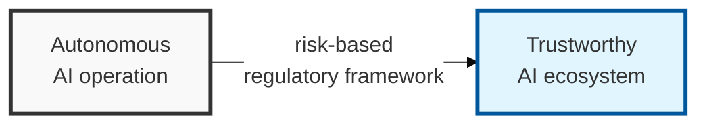

## I. Overview

**Definition**: The EU AI Act is the EU's legal framework that sets out obligations by risk level so that AI systems do not infringe on human safety, health, and fundamental rights.

**Features**:  
( **Risk-based regulation** ) Classifies AI systems into 4 risk tiers and imposes differentiated obligations accordingly.  
( **Human-centered design** ) Requires strict oversight of high-risk AI to protect human safety, health, and fundamental rights.  
( **Aiming for a global standard** ) Presents a model standard for AI governance and ethical guidelines worldwide, beyond Europe.

## II. Mechanism & Components

### The 4-Tier Risk-Based Classification System and Regulatory Content

| Risk Tier | Example Use Cases | Regulation and Obligations |
|:---:|-------------------|-----------------|
| 1. **Unacceptable** | Social scoring, real-time remote biometric identification, cognitive manipulation | Completely banned from release and use in the EU |
| 2. **High Risk** | Medical, transportation, education (hiring/evaluation), elections, law enforcement systems | Prior conformity assessment, data governance, logging, transparency obligations |
| 3. **Limited Risk** | Chatbots (LLMs), deepfakes, emotion-recognition systems | Disclosure obligation (must notify users that content is AI-generated) |
| 4. **Low / Minimal Risk** | Spam filters, AI-based games, simple algorithms | No regulation (voluntary code of conduct recommended) |

## III. Advanced Topics & Comparison

### Key Response Measures and Compliance Requirements

| Category | Response Measure Detail | Core Keyword |
|:---:|--------------|-----------|
| **Governance** | Build an AI risk management system and establish a quality management framework | AI Governance |
| **Data Protection** | Remove bias from training data and strengthen personal-information protection measures | Data Lineage |
| **Transparency** | Record the algorithm's decision-making process and secure explainability | XAI (Explainable AI) |
| **Human Oversight** | Design human oversight (HITL) able to intervene when the system malfunctions | **HITL** (Human-in-the-Loop) |

### EU AI Act vs. Existing Regulation (GDPR)

| Comparison Item | GDPR (Personal Information Protection) | EU AI Act |
|----------|----------------------|-----------------|
| Primary Protected Interest | Data subjects' personal data | Human safety and fundamental rights |
| Regulatory Approach | Regulates data-processing activity | Regulates the risk level of AI products and services |
| Scope of Application | The entire personal-information processing system | AI system models |
| Fine on Violation | Up to 4% of worldwide revenue | Up to 7% of worldwide revenue (for prohibited practices) |
