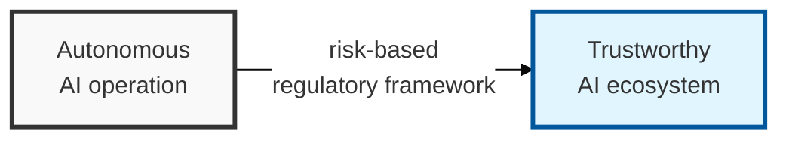

## I. Overview

**Definition**: The EU AI Act is the EU's legal framework that sets out obligations by risk level so that AI systems do not infringe on human safety, health, and fundamental rights.

**Features**:  
( **Risk-based regulation** ) Classifies AI systems into 4 risk tiers and imposes differentiated obligations accordingly.  
( **Human-centered design** ) Requires strict oversight of high-risk AI to protect human safety, health, and fundamental rights.  
( **Aiming for a global standard** ) Presents a model standard for AI governance and ethical guidelines worldwide, beyond Europe.

## II. Mechanism & Components

### The 4-Tier Risk-Based Classification System and Regulatory Content

| Risk Tier | Example Use Cases | Regulation and Obligations |
|:---:|-------------------|-----------------|
| 1. **Unacceptable** | Social scoring, real-time remote biometric identification, cognitive manipulation | Completely banned from release and use in the EU |
| 2. **High Risk** | Medical, transportation, education (hiring/evaluation), elections, law enforcement systems | Prior conformity assessment, data governance, logging, transparency obligations |
| 3. **Limited Risk** | Chatbots (LLMs), deepfakes, emotion-recognition systems | Disclosure obligation (must notify users that content is AI-generated) |
| 4. **Low / Minimal Risk** | Spam filters, AI-based games, simple algorithms | No regulation (voluntary code of conduct recommended) |

## III. Outlook & Future Direction

| Signal | Status | Direction |
|---|---|---|
| EU AI Act | In force, phased enforcement through 2026-2027 | Becoming the de facto global baseline for AI governance, the way GDPR became one for data protection |
| Non-EU regulatory response | Early-stage, fragmented across sector guidance and voluntary codes | Likely to converge toward the EU AI Act's risk-tiering rather than invent a competing model |

Expect the EU AI Act to follow GDPR's playbook: organizations outside the EU end up complying anyway, because maintaining a separate, lower-governance AI product line for non-EU markets costs more than building one compliant pipeline. Treat high-risk classification and human-oversight (HITL) design as a near-term roadmap item even for teams with no current EU footprint — retrofitting explainability and audit logging into a model that's already shipped is far more expensive than designing for it upfront.
