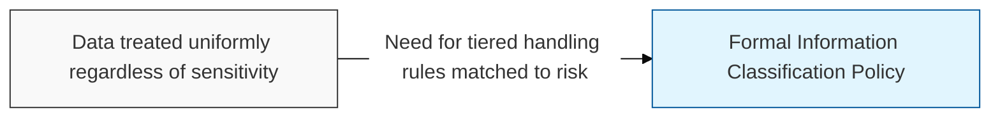
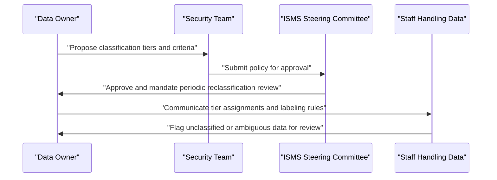

## I. Overview

An Information Classification Policy defines a small set of sensitivity tiers — such as public, internal, confidential, and restricted — and the handling rules (access, storage, transmission, disposal) attached to each. It is owned by data owners in partnership with the CISO or security team, since data owners best understand the business impact of exposure while security defines the technical controls per tier. Without a shared classification scheme, every other control — access rights, encryption requirements, transfer restrictions — has no consistent basis to apply against, so this policy underpins most of the rest of the security program.

## II. Structure & Process

| Field | Description |
|---|---|
| Classification Tiers | The defined sensitivity levels, e.g. public, internal, confidential, restricted. |
| Tier Criteria | Objective criteria for assigning data to each tier (legal, contractual, competitive impact). |
| Labeling Requirements | How classified data and documents must be marked, physically and digitally. |
| Handling Rules per Tier | Access, storage, transmission, and retention requirements for each tier. |
| Data Owner Responsibilities | Who assigns and can reclassify data, and how often classification is revisited. |
| Third-Party Handling | Rules for sharing classified data with vendors or partners. |
| Declassification Process | How and when data may be moved to a lower tier. |
| Exceptions | Process for handling data that doesn't map cleanly to a defined tier. |

Data owners propose tier assignments for the datasets they are accountable for, security defines the corresponding technical controls, and the ISMS steering committee approves the scheme. Classification of individual datasets is revisited whenever data inventory changes; the policy framework itself is reviewed annually.

## III. Best Practices & Comparison

| Document | Primary Purpose | Review Cadence | Owner |
|---|---|---|---|
| Information Classification Policy | Define sensitivity tiers and handling rules | Annual or on data inventory change | Data owners, security team |
| Information Transfer Policy | Govern secure movement of data between parties | Annual | CISO / GRC team |
| Disposal and Destruction Policy | Define destruction method by sensitivity tier | Annual | CISO / GRC team, IT operations |

- Keep the number of tiers small — three or four levels — so staff can apply them consistently without guesswork.
- Define tier criteria in business-impact terms, not technical jargon, so data owners can classify without security involvement for routine cases.
- Require labeling on both digital files and physical documents, not just one or the other.
- Tie every other control — access, transfer, disposal — back to classification tier rather than defining them independently.
- Revisit classification whenever a dataset's use, exposure, or regulatory context changes materially.

Related: [Information Transfer Policy](../information-transfer-policy/), [Disposal and Destruction Policy](../disposal-and-destruction-policy/).
