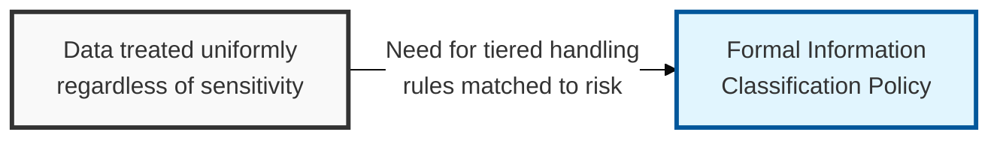
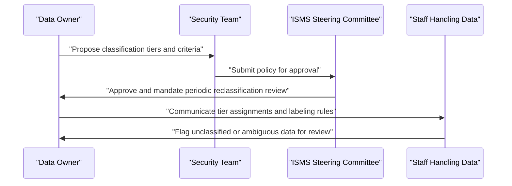

## I. Overview

**Definition**: An Information Classification Policy is the document that defines a small set of sensitivity tiers — such as public, internal, confidential, and restricted — and the handling rules attached to each.

**Features**:  
( **Ownership** ) Owned by data owners in partnership with the CISO or security team, pairing business-impact judgment with technical control design.  
( **Handling Rules** ) Attaches access, storage, transmission, and disposal rules to each sensitivity tier.  
( **Foundational Role** ) Underpins most of the rest of the security program, since access rights, encryption, and transfer restrictions all depend on it.  
( **Consistent Basis** ) Gives every other control a consistent basis to apply against, rather than ad hoc judgment calls.

## II. Structure & Process

| Field | Description |
|---|---|
| Classification Tiers | The defined sensitivity levels, e.g. public, internal, confidential, restricted. |
| Tier Criteria | Objective criteria for assigning data to each tier (legal, contractual, competitive impact). |
| Labeling Requirements | How classified data and documents must be marked, physically and digitally. |
| Handling Rules per Tier | Access, storage, transmission, and retention requirements for each tier. |
| Data Owner Responsibilities | Who assigns and can reclassify data, and how often classification is revisited. |
| Third-Party Handling | Rules for sharing classified data with vendors or partners. |
| Declassification Process | How and when data may be moved to a lower tier. |
| Exceptions | Process for handling data that doesn't map cleanly to a defined tier. |

Data owners propose tier assignments for the datasets they are accountable for, security defines the corresponding technical controls, and the ISMS steering committee approves the scheme. Classification of individual datasets is revisited whenever data inventory changes; the policy framework itself is reviewed annually.

## III. Expected Benefits & Implications

Classification is the one policy everything else quietly depends on — access control, encryption requirements, transfer restrictions, and disposal methods are only as consistent as the tiering scheme underneath them. Let it drift into a rubber-stamped formality, and every downstream control ends up justified by individual judgment calls instead of a shared standard.

| Benefit | Where It Shows Up |
|---|---|
| Consistent control application | Access, encryption, transfer, and disposal all reference one tier |
| Faster new-system rollout | New systems inherit handling rules instead of defining them from scratch |
| Reduced audit friction | One classification scheme, not ad hoc per-system judgment |
| Clearer data-owner accountability | Named owners tied to each tier assignment |

Keep the tier count small on purpose — three or four levels is what lets non-security staff classify data correctly without escalating every routine case, and a scheme with too many tiers usually collapses back to two in practice anyway.

Related: [Information Transfer Policy](../information-transfer-policy/), [Disposal and Destruction Policy](../disposal-and-destruction-policy/).
