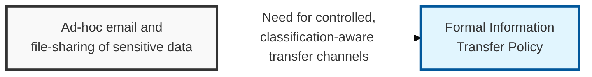
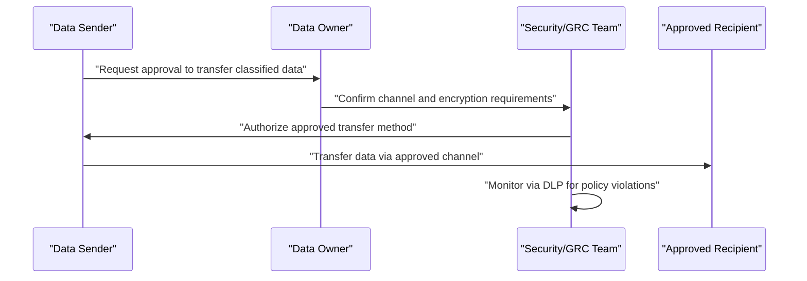

## I. Overview

**Definition**: An Information Transfer Policy is the document that defines the approved methods, controls, and authorization steps for moving data between people, systems, or organizations, matched to the data's classification tier.

**Features**:  
( **Ownership** ) Maintained by the CISO or GRC team and applied by everyone who sends or receives organizational data.  
( **Channel Coverage** ) Spans email, file transfer, physical media, and API integration.  
( **Technical Enforcement** ) Enforces heavier controls through IT tooling such as encrypted transfer gateways or data loss prevention (DLP) systems.  
( **Control Continuity** ) Protects the point where data most often leaves the organization's direct control, preserving classification and access controls set elsewhere.

## II. Structure & Process

| Field | Description |
|---|---|
| Approved Channels | Permitted transfer methods per classification tier — encrypted email, secure file transfer, physical courier. |
| Encryption Requirements | Minimum encryption standard for data in transit, by tier. |
| Third-Party Transfer Rules | Requirements before sharing data with vendors or partners, including contractual data-protection clauses. |
| Physical Media Controls | Rules for transferring data on removable media or hardware. |
| Authorization Requirements | Who must approve transfer of confidential or restricted data before it occurs. |
| DLP/Monitoring | Automated controls that detect or block unauthorized transfer attempts. |
| Cross-Border Transfer | Additional legal review required when data crosses jurisdictional boundaries. |
| Incident Reporting | Process for reporting a transfer made in error or to an unauthorized recipient. |

The data owner authorizes transfer of confidential or restricted data, security confirms the required channel and encryption controls, and DLP tooling monitors for violations after the fact. The policy is reviewed annually and whenever a new transfer channel or third-party integration is introduced.

## III. Adoption Considerations & Security Measures

| Risk | Primary Control |
|---|---|
| Sensitive data sent via an unapproved channel | Channel mapped explicitly to classification tier |
| Data exposed while in transit | Mandatory encryption above the lowest sensitivity tier |
| Vendor mishandling shared data | Data-protection clauses in place before transfer begins |
| Transfer crossing a jurisdictional boundary unnoticed | Mandatory legal review for cross-border transfer |

DLP monitoring catches violations after the fact — it's a detective control, not a preventive one. The real preventive work happens earlier, when the channel gets mapped to a classification tier and encryption gets made non-negotiable rather than "recommended," because by the time DLP flags an outbound email, the recipient has usually already opened it.

Related: [Information Classification Policy](../information-classification-policy/), [Password Policy](../password-policy/).
