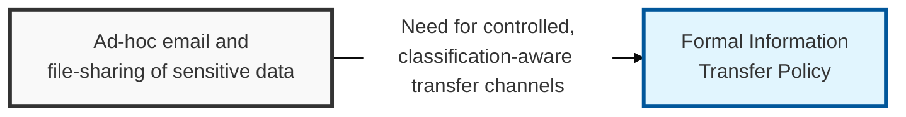
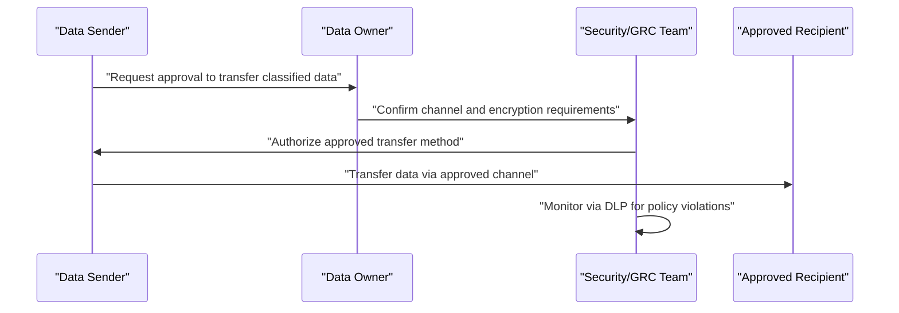

## I. Overview

**Definition**: An Information Transfer Policy is the document that defines the approved methods, controls, and authorization steps for moving data between people, systems, or organizations, matched to the data's classification tier.

**Features**:  
( **Ownership** ) Maintained by the CISO or GRC team and applied by everyone who sends or receives organizational data.  
( **Channel Coverage** ) Spans email, file transfer, physical media, and API integration.  
( **Technical Enforcement** ) Enforces heavier controls through IT tooling such as encrypted transfer gateways or data loss prevention (DLP) systems.  
( **Control Continuity** ) Protects the point where data most often leaves the organization's direct control, preserving classification and access controls set elsewhere.

## II. Structure & Process

| Field | Description |
|---|---|
| Approved Channels | Permitted transfer methods per classification tier — encrypted email, secure file transfer, physical courier. |
| Encryption Requirements | Minimum encryption standard for data in transit, by tier. |
| Third-Party Transfer Rules | Requirements before sharing data with vendors or partners, including contractual data-protection clauses. |
| Physical Media Controls | Rules for transferring data on removable media or hardware. |
| Authorization Requirements | Who must approve transfer of confidential or restricted data before it occurs. |
| DLP/Monitoring | Automated controls that detect or block unauthorized transfer attempts. |
| Cross-Border Transfer | Additional legal review required when data crosses jurisdictional boundaries. |
| Incident Reporting | Process for reporting a transfer made in error or to an unauthorized recipient. |

The data owner authorizes transfer of confidential or restricted data, security confirms the required channel and encryption controls, and DLP tooling monitors for violations after the fact. The policy is reviewed annually and whenever a new transfer channel or third-party integration is introduced.

## III. Best Practices & Comparison

| Document | Primary Purpose | Review Cadence | Owner |
|---|---|---|---|
| Information Transfer Policy | Govern secure movement of data between parties | Annual | CISO / GRC team |
| Information Classification Policy | Define sensitivity tiers that transfer controls are matched to | Annual or on data inventory change | Data owners, security team |
| Password Policy | Set authentication requirements protecting transfer channels | Annual | CISO / IAM team |

- Map every approved transfer channel explicitly to a classification tier, rather than leaving the choice to individual judgment.
- Require encryption in transit for anything above the lowest sensitivity tier, with no exceptions for convenience.
- Attach data-protection clauses to vendor and partner contracts before any transfer begins.
- Deploy DLP monitoring on outbound channels most likely to carry sensitive data — email, cloud storage, removable media.
- Require legal review for any transfer that crosses a jurisdictional boundary with different data-protection law.

Related: [Information Classification Policy](../information-classification-policy/), [Password Policy](../password-policy/).
