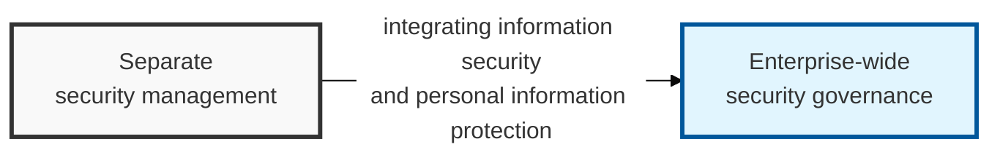
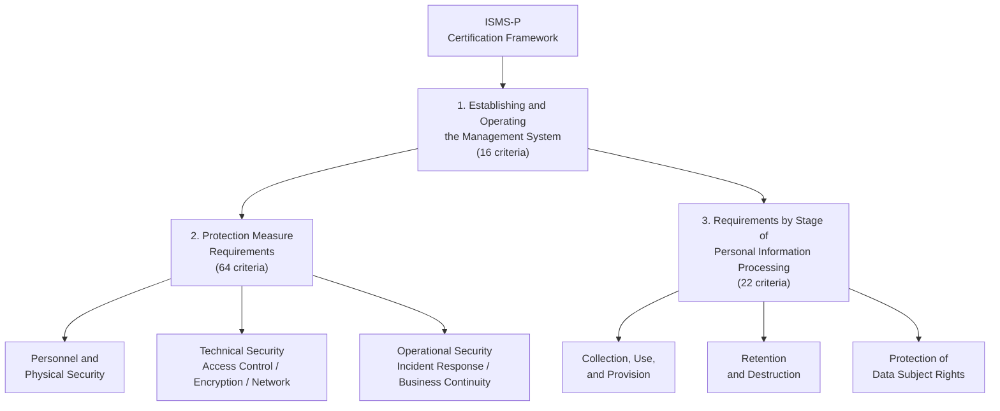

## I. Overview

**Definition**: ISMS-P integrates the information security management system ( **ISMS** ) and the personal information management system ( **PIMS** ) into a single management system, and is Korea's most comprehensive certification scheme, designed to let organizations respond to security threats on their own.

**Background of the integration**:  
( **Removing duplication** ) Eliminates the overlap between two similar certification schemes ( **ISMS** + **PIMS** ), reducing the administrative burden on organizations.  
( **Governance integration** ) Operates information security and personal information protection organically within a single management system, improving efficiency.  
( **Stronger security** ) Strengthens the ability to respond to personal information breaches and secures legal compliance.

## II. Mechanism & Components

### Certification Framework

> **Key point**: Information security and personal information protection measures are organically linked, built on the establishment and operation of the management system.

### Key Certification Criteria by Area

| Certification Area | Number of Criteria | Key Content |
|-----------|:-----------:|----------------------|
| 1. Establishing and Operating the Management System | 16 | Establishing the management system, risk management, operating the PDCA (Plan-Do-Check-Act) cycle |
| 2. Protection Measure Requirements | 64 | Personnel security, physical security, network security, system access control, incident response |
| 3. Requirements by Stage of Personal Information Processing | 22 | Protecting data subject rights and ensuring legal compliance during collection, use/provision, and destruction |

## III. Outlook & Future Direction

| Trend | Status | Direction |
|---|---|---|
| Cloud-native adoption by ISMS-P-certified organizations | Accelerating | Requires closer linkage with CSAP rather than parallel, disconnected certification tracks |
| International interoperability with ISO 27001 | Limited today | Growing pressure to align so certification evidence isn't duplicated for global customers |

The certification's real bottleneck going forward isn't the audit itself — it's that a Korean company selling globally often ends up running ISMS-P and ISO 27001 as two separate programs with heavily overlapping evidence requirements. Expect KISA to keep pushing toward mutual recognition or a shared control-mapping approach, and organizations that build their evidence collection to serve both standards from day one will spend far less on certification maintenance than those that treat them as unrelated projects.
