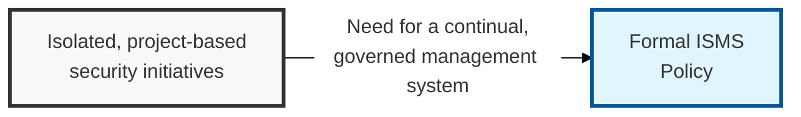
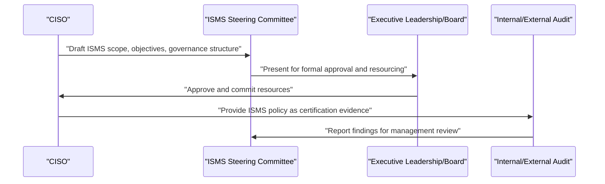

## I. Overview

**Definition**: The ISMS (Information Security Management System) Policy is the top-level charter document that establishes the scope, objectives, and governance structure for how an organization manages information security on an ongoing basis.

**Features**:  
( **Ownership** ) Owned by the CISO and formally approved by executive leadership or the board.  
( **Governance Commitment** ) Commits the organization to resourcing and accountability for security at the governance level.  
( **Continual Improvement** ) Follows a plan-do-check-act cycle rather than isolated, project-based security efforts.  
( **Standards Alignment** ) Provides the structure expected by standards such as ISO/IEC 27001 and required for many certification and regulatory regimes.

## II. Structure & Process

| Field | Description |
|---|---|
| Scope Statement | Business units, systems, and locations the ISMS covers. |
| Security Objectives | High-level goals the ISMS is designed to achieve, tied to business risk appetite. |
| Governance Structure | Roles and committees responsible for ISMS oversight, e.g. the ISMS steering committee. |
| Risk Management Approach | Reference to the risk assessment and treatment methodology the ISMS follows. |
| Policy Hierarchy | How subordinate policies (password, classification, transfer) relate back to this charter. |
| Legal & Regulatory Commitment | Statement of commitment to applicable laws, standards, and contractual obligations. |
| Continual Improvement Cycle | The plan-do-check-act (or equivalent) cadence for reviewing and improving the ISMS. |
| Management Review | Frequency and scope of leadership review of ISMS performance. |

The CISO drafts the ISMS charter with the steering committee, executive leadership approves it and commits resources, and internal or external audit periodically validates that the ISMS operates as documented. Management review occurs at least annually, feeding into the plan-do-check-act improvement cycle.

## III. Best Practices & Comparison

| Document | Primary Purpose | Review Cadence | Owner |
|---|---|---|---|
| ISMS Policy | Charter the overarching security management system | Annual | CISO, executive leadership |
| Compliance Management | Track adherence to obligations the ISMS commits to | Continuous, with periodic formal reporting | CISO / GRC team |
| Acceptable Use of Assets Policy | Operationalize one subordinate control area of the ISMS | Annual | CISO / GRC team |

- Keep the ISMS policy at the charter level — objectives, scope, governance — and push operational detail into subordinate policies it references.
- Secure explicit executive or board sign-off, since the ISMS commits the organization to resourcing, not just intent.
- Anchor the risk management approach referenced in the ISMS to a documented, repeatable methodology.
- Schedule management review on a fixed cadence and use it to drive the plan-do-check-act improvement cycle, not as a formality.
- Map every subordinate security policy explicitly back to this charter so the policy hierarchy stays coherent under audit.

Related: [Compliance Management](../compliance-management/), [Acceptable Use of Assets Policy](../acceptable-use-of-assets-policy/).
