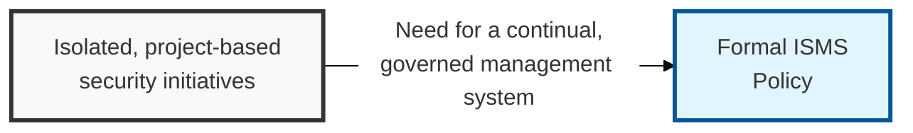
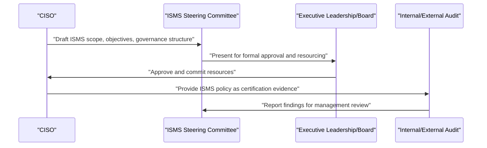

## I. Overview

**Definition**: The ISMS (Information Security Management System) Policy is the top-level charter document that establishes the scope, objectives, and governance structure for how an organization manages information security on an ongoing basis.

**Features**:  
( **Ownership** ) Owned by the CISO and formally approved by executive leadership or the board.  
( **Governance Commitment** ) Commits the organization to resourcing and accountability for security at the governance level.  
( **Continual Improvement** ) Follows a plan-do-check-act cycle rather than isolated, project-based security efforts.  
( **Standards Alignment** ) Provides the structure expected by standards such as ISO/IEC 27001 and required for many certification and regulatory regimes.

## II. Structure & Process

| Field | Description |
|---|---|
| Scope Statement | Business units, systems, and locations the ISMS covers. |
| Security Objectives | High-level goals the ISMS is designed to achieve, tied to business risk appetite. |
| Governance Structure | Roles and committees responsible for ISMS oversight, e.g. the ISMS steering committee. |
| Risk Management Approach | Reference to the risk assessment and treatment methodology the ISMS follows. |
| Policy Hierarchy | How subordinate policies (password, classification, transfer) relate back to this charter. |
| Legal & Regulatory Commitment | Statement of commitment to applicable laws, standards, and contractual obligations. |
| Continual Improvement Cycle | The plan-do-check-act (or equivalent) cadence for reviewing and improving the ISMS. |
| Management Review | Frequency and scope of leadership review of ISMS performance. |

The CISO drafts the ISMS charter with the steering committee, executive leadership approves it and commits resources, and internal or external audit periodically validates that the ISMS operates as documented. Management review occurs at least annually, feeding into the plan-do-check-act improvement cycle.

## III. Expected Benefits & Implications

The ISMS policy's real value isn't the charter document itself — it's that executive sign-off converts security from a line item IT negotiates for annually into a governance commitment the board is accountable for. That distinction is what survives a budget-cutting cycle and what an auditor actually checks for.

| Benefit | Where It Shows Up |
|---|---|
| Durable executive commitment to resourcing | Security budget survives leadership turnover and cost-cutting |
| Coherent policy hierarchy | Subordinate policies map back to one charter instead of drifting independently |
| Certification readiness | Baseline structure expected by ISO 27001 and similar regimes |
| Structured continual improvement | PDCA cadence instead of reactive, project-based fixes |

Push operational detail out of the charter and into subordinate policies — an ISMS policy that tries to specify password rules or backup cadences directly turns into a maintenance burden that needs revision every time an operational detail changes, defeating the point of having a stable top-level document.

Related: [Compliance Management](../compliance-management/), [Acceptable Use of Assets Policy](../acceptable-use-of-assets-policy/).
