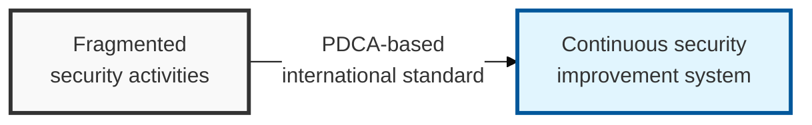

## I. Overview

**Definition**: ISO 27001 is an international standard for an information security management system that sets out a systematic management process to maintain the confidentiality, integrity, and availability (CIA) of information assets through continuous improvement.

**Features**:  
( **Securing the CIA triad** ) A systematic management process for maintaining the confidentiality, integrity, and availability (CIA) of information assets.  
( **Continuous improvement** ) The information security management system is constantly upgraded through the PDCA (Plan-Do-Check-Act) model.  
( **Global credibility** ) International certification raises external trust in security and strengthens business competitiveness.

## II. Mechanism & Components

### Operating Structure (PDCA Cycle)

- **Plan**: Define scope, establish the security policy, perform risk assessment and treatment planning.
- **Do**: Implement and operate the security control items.
- **Check**: Conduct internal audits, management review, and performance measurement.
- **Act**: Take corrective action on nonconformities and drive continuous improvement.

### The 4 Control Themes of Annex A (ISO 27001:2022 Revision)

The 2022 revision consolidated and restructured the previous 14 domains into 4 themes.

| Control Theme | Number of Controls | Key Content |
|:---:|:---:|-----------|
| 1. **Organizational Controls** | 37 | Security policy, asset management, security of cloud service use |
| 2. **People Controls** | 8 | Security before, during, and after employment; remote work security |
| 3. **Physical Controls** | 14 | Access control, facility security, maintaining device security |
| 4. **Technological Controls** | 34 | Authentication, encryption, network security, secure coding |

## III. Advanced Topics & Comparison

| Comparison Item | ISO 27001 (International Standard) | ISMS-P (Korean Standard) |
|----------|----------------------|-------------------|
| **Certifying Body** | ISO (International Organization for Standardization) | KISA (Korea Internet & Security Agency) |
| **Legal Force** | Voluntary certification (for building global credibility) | Mandatory certification (for organizations above a certain size) |
| **Certification Scope** | All industries (globally recognized) | Domestic operators (mainly ICT services) |
| **Key Difference** | Focused on governance and framework | Strengthened personal information (privacy) requirements |
| **Number of Controls** | 93 controls (2022 version) | 102 criteria (16 management, 64 protection measures, 22 personal information) |
