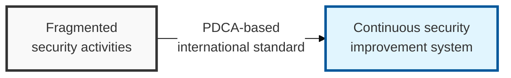

## I. Overview

**Definition**: ISO 27001 is an international standard for an information security management system that sets out a systematic management process to maintain the confidentiality, integrity, and availability (CIA) of information assets through continuous improvement.

**Features**:  
( **Securing the CIA triad** ) A systematic management process for maintaining the confidentiality, integrity, and availability (CIA) of information assets.  
( **Continuous improvement** ) The information security management system is constantly upgraded through the PDCA (Plan-Do-Check-Act) model.  
( **Global credibility** ) International certification raises external trust in security and strengthens business competitiveness.

## II. Mechanism & Components

### Operating Structure (PDCA Cycle)

- **Plan**: Define scope, establish the security policy, perform risk assessment and treatment planning.
- **Do**: Implement and operate the security control items.
- **Check**: Conduct internal audits, management review, and performance measurement.
- **Act**: Take corrective action on nonconformities and drive continuous improvement.

### The 4 Control Themes of Annex A (ISO 27001:2022 Revision)

The 2022 revision consolidated and restructured the previous 14 domains into 4 themes.

| Control Theme | Number of Controls | Key Content |
|:---:|:---:|-----------|
| 1. **Organizational Controls** | 37 | Security policy, asset management, security of cloud service use |
| 2. **People Controls** | 8 | Security before, during, and after employment; remote work security |
| 3. **Physical Controls** | 14 | Access control, facility security, maintaining device security |
| 4. **Technological Controls** | 34 | Authentication, encryption, network security, secure coding |

## III. Expected Benefits & Implications

ISO 27001 certification's real payoff shows up outside the security team entirely — it's the artifact that shortens vendor security questionnaires, satisfies enterprise procurement requirements, and gives sales a credible answer to "how do you protect our data" without a bespoke response every time. The mandated PDCA cycle is what keeps the certification from becoming a one-time snapshot that quietly goes stale between surveillance audits.

| Benefit | Where It Shows Up |
|---|---|
| Faster enterprise sales cycles | Vendor security review, RFP responses |
| Global credibility beyond any single jurisdiction | Recognized across industries and geographies, unlike domestic-only schemes |
| Forced continuous improvement | Annual surveillance audits catch drift between certification cycles |
| Structured accountability | Control ownership mapped across the 4 Annex A themes |

For organizations already pursuing a domestic scheme like ISMS-P, treat ISO 27001 as complementary rather than redundant — ISMS-P's mandatory status and stronger personal-information requirements cover the domestic compliance floor, while ISO 27001's voluntary, globally recognized certification is what actually opens conversations with international customers who have never heard of ISMS-P.
