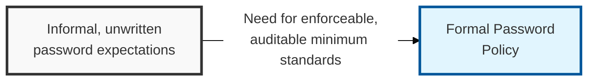
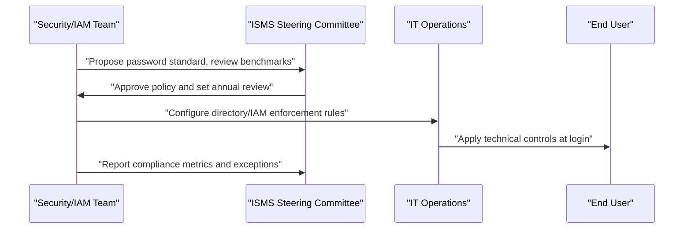

## I. Overview

**Definition**: A Password Policy is the document that defines the minimum authentication standards employees and systems must meet — length, complexity, rotation, reuse restrictions, and where multi-factor authentication (MFA) is mandatory.

**Features**:  
( **Ownership** ) Maintained by the CISO or IT security team and technically enforced through identity and access management (IAM) tooling and directory services.  
( **Breach Prevention** ) Closes off weak or reused credentials, one of the most common initial-access vectors in breaches.  
( **Regulatory Baseline** ) Gives regulators and auditors a documented baseline rather than per-system, ad hoc rules.  
( **MFA Requirements** ) Specifies where multi-factor authentication is mandatory alongside password strength rules.

## II. Structure & Process

| Field | Description |
|---|---|
| Minimum Length & Complexity | Character-length floor and composition rules, or passphrase guidance where complexity rules are relaxed. |
| Rotation Requirements | Whether and how often passwords must change, distinguishing standard and privileged accounts. |
| Reuse Restrictions | Number of prior passwords that cannot be reused. |
| MFA Requirements | Systems and roles where multi-factor authentication is mandatory. |
| Lockout Thresholds | Failed-attempt count that triggers account lockout, and unlock procedure. |
| Storage & Transmission | Requirement that passwords be hashed at rest and never transmitted in plaintext. |
| Privileged Account Rules | Stricter requirements for admin, service, and root-level accounts, often paired with a password vault. |
| Exception Process | How a system that cannot meet the standard (legacy application) is documented and compensated for. |

Security drafts the standard against current industry guidance, the ISMS steering committee approves it, and IT operations implements enforcement through directory policy and MFA configuration. The policy is reviewed annually and whenever authentication guidance from standards bodies materially changes.

## III. Best Practices & Comparison

| Document | Primary Purpose | Review Cadence | Owner |
|---|---|---|---|
| Password Policy | Set authentication strength and MFA requirements | Annual | CISO / IAM team |
| Acceptable Use of Assets Policy | Define permitted use of company IT assets | Annual | CISO / GRC team |
| Information Transfer Policy | Govern secure movement of data between parties | Annual | CISO / GRC team |

- Favor passphrase length and MFA over frequent forced rotation, which research shows drives weaker password choices.
- Mandate MFA on all remote access, privileged accounts, and systems holding sensitive data.
- Never store or log passwords in plaintext; require salted hashing at rest.
- Vault and rotate service-account and shared credentials separately from user password rules.
- Monitor for credential exposure in breach data and force resets when matches are found.

Related: [Acceptable Use of Assets Policy](../acceptable-use-of-assets-policy/), [Information Transfer Policy](../information-transfer-policy/).
