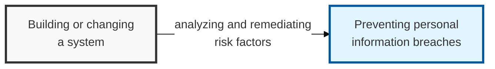

## I. Overview

**Definition**: A Privacy Impact Assessment (PIA) is an institutional procedure that analyzes personal-information risk factors and derives improvements whenever a system operating personal information files is built or changed.

**Features**:  
( **Privacy by Design** ) Personal-information protection considerations are reflected in the design from the earliest stage of system development.  
( **Breach prevention** ) Potential personal-information exposure risks are analyzed in advance to prevent breaches at the source.  
( **Legal safety** ) Compliance with the Personal Information Protection Act and related legislation resolves legal risk and improves organizational trust.

## II. Mechanism & Components

### Mandatory Assessment Targets (for Public Agencies)

- Personal information files that include sensitive information or unique identification information on 50,000 or more data subjects.
- Personal information files that link and process personal information on 500,000 or more data subjects.
- Building or changing a personal information file covering 1,000,000 or more data subjects.

### Step-by-Step Procedure

| Step | Key Activities | Key Deliverable |
|:---:|---------------|-----------|
| 1. Assessment Preparation | Select the assessment agency, form the assessment team, draft the assessment plan | Assessment contract, assessment plan |
| 2. Data Collection | Analyze data flow, understand system structure, conduct interviews | Personal information flow/mapping diagram |
| 3. Risk Analysis | Check compliance with personal-information protection principles, identify risk factors | Risk analysis report |
| 4. Developing Improvements | Establish measures to remove or mitigate identified risks | Improvement recommendations |
| 5. Reporting Results | Draft the assessment result report and submit it to the Ministry of the Interior and Safety / Personal Information Protection Commission | Assessment result report |

## III. Advanced Topics & Comparison

### Risk Analysis Items and Response Measures

| Risk Analysis Item (Area) | Key Review Content | Response and Improvement Measures |
|-------------------|--------------|-----------------|
| Managing the target system | Appropriateness of collection, retention, use, and provision procedures for personal information | Clarify the legal basis, apply the minimum-collection principle |
| Technical protection measures | Whether encryption, access control, and access-log management are in place | DB encryption (API/TDE), adopt 2FA, retain logs |
| Administrative protection measures | Establishing internal management plans, training, managing personal-information handlers | Regular training, differentiated authority for handlers |
| Physical protection measures | Access control for the computer room, security of auxiliary storage media | Install locking devices, adopt media control solutions |

### PIA vs. ISMS-P Certification

| Comparison Item | Privacy Impact Assessment (PIA) | ISMS-P Certification |
|----------|----------------------|------------|
| Main Purpose | Preventing risk before introducing a specific system | Verifying the continuous operation of the security management system |
| Timing | At system build/change time (pre-action) | During system operation (post-action/annual) |
| Legal Basis | Article 33 of the Personal Information Protection Act | Article 32-2 of the Personal Information Protection Act |
| Unit of Assessment | A specific personal information file and system | The entire organization or a service unit |
