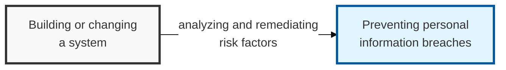

## I. Overview

**Definition**: A Privacy Impact Assessment (PIA) is an institutional procedure that analyzes personal-information risk factors and derives improvements whenever a system operating personal information files is built or changed.

**Features**:  
( **Privacy by Design** ) Personal-information protection considerations are reflected in the design from the earliest stage of system development.  
( **Breach prevention** ) Potential personal-information exposure risks are analyzed in advance to prevent breaches at the source.  
( **Legal safety** ) Compliance with the Personal Information Protection Act and related legislation resolves legal risk and improves organizational trust.

## II. Mechanism & Components

### Mandatory Assessment Targets (for Public Agencies)

- Personal information files that include sensitive information or unique identification information on 50,000 or more data subjects.
- Personal information files that link and process personal information on 500,000 or more data subjects.
- Building or changing a personal information file covering 1,000,000 or more data subjects.

### Step-by-Step Procedure

| Step | Key Activities | Key Deliverable |
|:---:|---------------|-----------|
| 1. Assessment Preparation | Select the assessment agency, form the assessment team, draft the assessment plan | Assessment contract, assessment plan |
| 2. Data Collection | Analyze data flow, understand system structure, conduct interviews | Personal information flow/mapping diagram |
| 3. Risk Analysis | Check compliance with personal-information protection principles, identify risk factors | Risk analysis report |
| 4. Developing Improvements | Establish measures to remove or mitigate identified risks | Improvement recommendations |
| 5. Reporting Results | Draft the assessment result report and submit it to the Ministry of the Interior and Safety / Personal Information Protection Commission | Assessment result report |

## III. Adoption Considerations & Security Measures

| Risk Area | Primary Control |
|---|---|
| Collecting more personal information than the stated purpose requires | Minimum-collection principle, documented legal basis |
| Weak technical safeguards around stored personal information | DB encryption (API/TDE), access control, 2FA, retained access logs |
| Handlers without differentiated access or training | Internal management plan, regular training, role-based authority |
| Physical exposure of storage media or the server room | Locking devices, media control solutions, restricted room access |

Run the PIA before the system is built, not after — its entire value is catching a re-identification or over-collection risk while it's still a design change instead of a production incident. Treat it as complementary to, not a substitute for, ISMS-P: a PIA clears one system at build time (Article 33), while ISMS-P verifies the whole management system keeps operating correctly year over year, and organizations that only do one end up blind to the other's failure mode.
