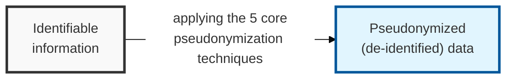
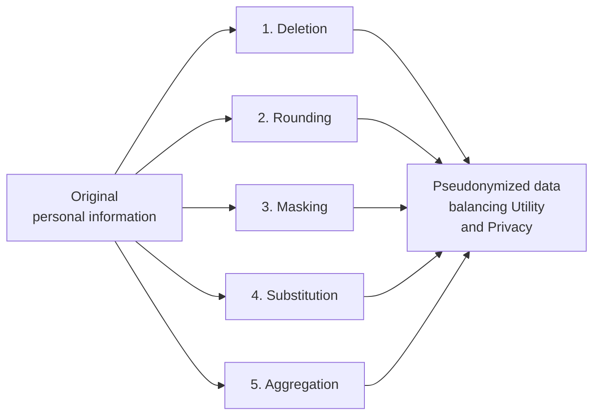

## I. Overview

**Definition**: Pseudonymization techniques are technical methods that delete or substitute part of personal information so that a specific individual cannot be identified without additional information.

**Core value and purpose**:  
( **Data Utility** ) Preserves the data's statistical properties and quality ( **Utility** ) so it still fits the intended analysis purpose.  
( **Privacy Protection** ) Minimizes re-identification risk to safeguard data subjects' privacy rights.  
( **Risk Management** ) Secures legal compliance through technical measures and cuts off the risk of a security incident (re-identification) at the source.

## II. Mechanism & Components

### The 5 Core Pseudonymization Techniques and Their Sub-Methods

| Pseudonymization Technique | Detailed Description | Concrete Example |
|-------------|---------|-----------|
| 1. Deletion | Directly deletes fields containing identifiers, or removes specific items | Fully deleting name, resident registration number, phone number |
| 2. Rounding | Converts numerical data into a range (bucket) or rounds it | Age 26 → "20s"; salary 3.54 million won → "3-4 million won" |
| 3. Masking | Replaces part of the data with a special character such as an asterisk (*) to prevent identification | Hong Gil-dong → Hong *dong; Gangnam-gu, Seoul → **-gu, Seoul |
| 4. Substitution | Replaces an identifier with an arbitrary unique or virtual number | Resident registration number → replaced with a serial number (A-001) |
| 5. Aggregation | Processes data as a group total or average rather than individual records | Individual income → converted to average income by department |

## III. Comparison & Application

Pseudonymization techniques are more often mixed according to the characteristics of the data than used alone, and the resulting dataset is typically validated against one of the following privacy-protection models.

| Model | Core Concept | Best Fit | Weakness |
|---|---|---|---|
| k-Anonymity | At least k records share the same attributes | Baseline defense against linking attacks | Vulnerable to homogeneity attacks within a k-group |
| l-Diversity | At least l distinct sensitive values per k-group | Datasets where the sensitive value needs variation within each group | Can noticeably reduce data utility |
| t-Closeness | A group's sensitive-value distribution stays close to the overall distribution | Highest-assurance releases against skewness and similarity attacks | Complex and costly to implement correctly |

Don't pick a model based on which one is easiest to implement — pick it based on which attack the dataset is actually exposed to. A dataset with a skewed sensitive attribute, such as a rare condition concentrated in one subgroup, needs t-closeness or it isn't meaningfully protected even after it passes k-anonymity and l-diversity checks; teams that stop at k-anonymity because it's simplest are often defending against the attack that was already the least likely one.
